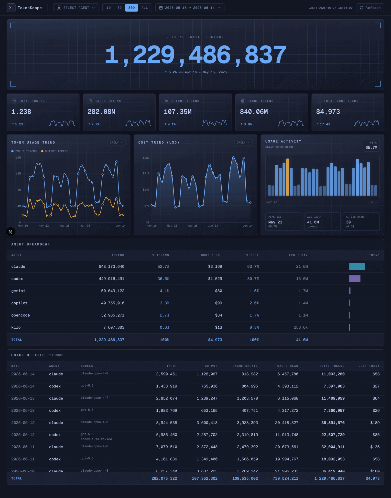

# TokenScope

Dark-mode dashboard for tracking AI coding-agent token usage, cost, model mix, and activity trends. Powered by [ccusage](https://github.com/ryoppippi/ccusage).



## Features

- **Per-agent breakdown** — Fans out `ccusage <agent> daily` in parallel for every known agent; every row keeps its real agent identity (no `"all"` aggregation).
- **One snapshot powers everything** — A single daily-granularity snapshot at `.cache/usage-snapshot.json` feeds Daily / Weekly / Monthly views, agent filter, date range, totals, charts, and the details table — all rebucketed in the browser.
- **Headless refresh** — `pnpm refresh-cache` runs the full collection pipeline (same code path the server uses) and writes the snapshot to disk. Automatically prepended to `dev` and `build`, so the dashboard never boots cold.
- **Live refresh** — The Refresh button in the header forces a re-collection; SWR keeps the prior snapshot on screen while the new one is in flight.

## Supported agents

`claude`, `codex`, `opencode`, `amp`, `droid`, `codebuff`, `hermes`, `pi`, `goose`, `kilo`, `copilot`, `gemini`, `kimi`, `qwen`, `openclaw`

(Source of truth: `KNOWN_AGENTS` in [`lib/types.ts`](./lib/types.ts).)

## Getting started

Prerequisites:

- Node.js 22+
- pnpm 10+

```bash
# Install
pnpm install

# Dev — refresh cache, then start Next.js on http://127.0.0.1:3300
pnpm dev

# Production build (auto-refreshes cache first)
pnpm build
pnpm start

# Manually refresh the disk snapshot (no server)
pnpm refresh-cache
```

PM2 deployment:

```bash
pnpm pm2:start   # build + start under PM2
pnpm pm2:logs
pnpm pm2:stop
```

## Architecture

- **Collection** — `lib/usage-source.ts` shells out to `ccusage <agent> daily --json --offline` in parallel (`Promise.allSettled`), normalises each per-agent payload, and assembles a single `DataSnapshot` of every agent × day row, all-time. Failures land in `failedAgents` and surface in the UI.
- **Caching** — Memory (5-min TTL) → disk (`.cache/usage-snapshot.json`) → live collection. Stale entries return immediately while a background refresh repopulates for the next caller.
- **Preheat** — `instrumentation.ts` → `lib/preheat.ts` triggers one forced refresh on Next.js boot, then another every 10 minutes. Skipped during `next build` and Vitest runs.
- **API** — `GET /api/data` returns the whole snapshot. Filters / aggregations / rebucketing happen in the browser; the server never slices per request.

## Tests

```bash
pnpm test         # one-shot
pnpm test:watch   # watch mode
```

## License

[MIT](./LICENSE)
